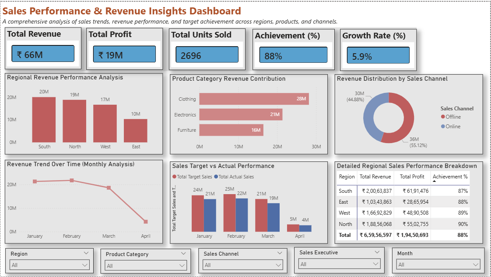

# sales-performance-revenue-dashboard-powerbi
Interactive Power BI dashboard analyzing sales performance, revenue growth, and business insights

🎯 Objective
To analyze sales performance, revenue growth, and business trends using Power BI.

🛠 Tools Used
- Power BI
- Excel
- DAX
- Power Query

📁 Dataset
Includes sales data with region, product, revenue, cost, and profit details.

📊 Dashboard Features
- KPI Cards (Revenue, Profit, Growth)
- Region-wise Performance
- Category Analysis
- Monthly Trends
- Target vs Actual Comparison

📈 Key Insights
- Identified top-performing regions
- Analyzed most profitable products
- Evaluated sales target achievement

🖼 Dashboard Preview

🚀 Conclusion
This dashboard helps businesses make data-driven decisions and improve sales strategy.
